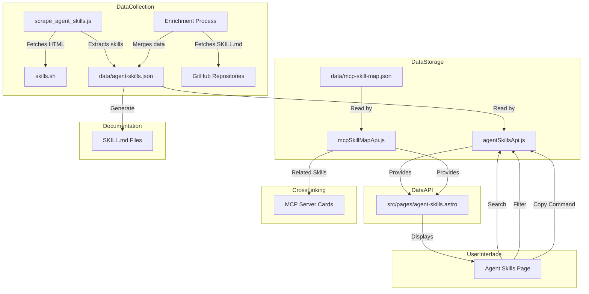
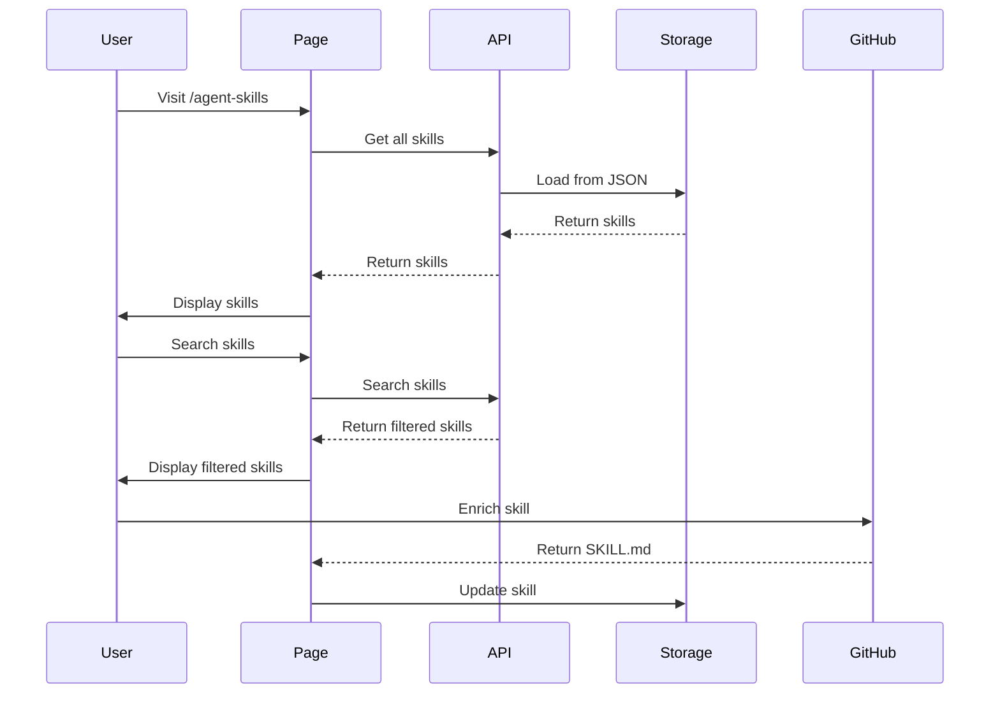
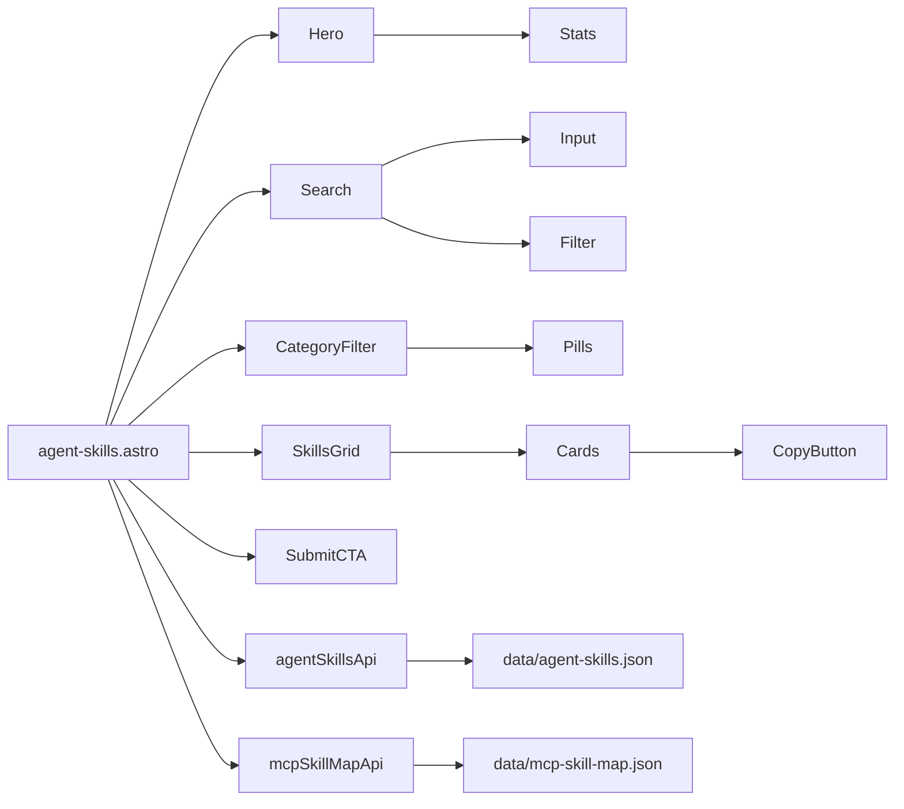
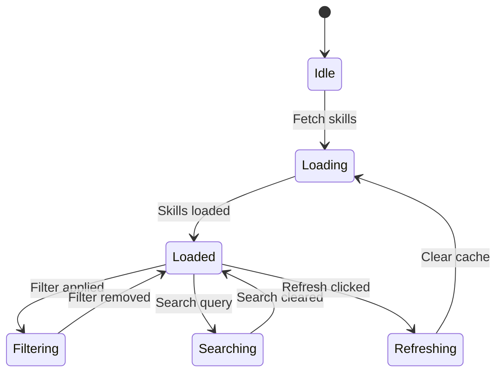

# Agent Skills Design Document

## Overview

The Agent Skills feature builds a comprehensive directory system for MCP (Model Context Protocol) agent skills. This system replaces the existing `/claude-skills` page with a broader scope covering all MCP agent skills. The feature includes:

- **Data Collection**: Scraping skills from skills.sh and enriching with GitHub SKILL.md files
- **Data Storage**: JSON files for skills and MCP-skill mappings
- **Data API**: Clean API utilities for frontend access
- **User Interface**: A new `/agent-skills` page with search, filtering, and skill cards
- **Cross-linking**: Related skills display on MCP server cards
- **Documentation**: SKILL.md file generation for external repository

The system is designed for accessibility, dark mode support, mobile responsiveness, and performance through caching.

## Architecture



## Components and Interfaces

### Data Collection Components

#### scrape_agent_skills.js

**Location**: `scripts/scrape_agent_skills.js`

**Purpose**: Scrapes skills from skills.sh and enriches with GitHub data

**Key Functions**:

```javascript
// Main scraping function
async function scrapeSkills() {
  // 1. Fetch HTML from skills.sh
  // 2. Parse HTML and extract skill entries
  // 3. Enrich with GitHub data
  // 4. Validate and save to JSON
}

// Retry mechanism
async function fetchWithRetry(url, maxRetries = 3) {
  // Retry up to 3 times with exponential backoff
}

// GitHub enrichment
async function enrichFromGitHub(skill) {
  // Fetch SKILL.md from GitHub
  // Extract description, installation command, metadata
  // Merge with scraped data
}
```

**Data Flow**:
1. Fetch skills.sh HTML
2. Parse HTML to extract skill entries
3. For each skill, attempt GitHub enrichment
4. Validate entries
5. Save to `data/agent-skills.json`

#### Categorization Logic

Skills are categorized based on their metadata and content:

```javascript
const CATEGORIES = [
  'development',
  'data',
  'api',
  'automation',
  'analytics',
  'communication',
  'productivity',
  'other'
];

function categorizeSkill(skill) {
  // Analyze skill name, description, and tags
  // Return appropriate category
}
```

### Data Storage Components

#### data/agent-skills.json

**Schema**:

```json
{
  "skills": [
    {
      "name": "string",
      "description": "string",
      "installationCommand": "string",
      "githubUrl": "string",
      "publisher": "string",
      "rank": "number | null",
      "category": "string",
      "relatedMcpServers": ["string"],
      "tags": ["string"],
      "createdAt": "string",
      "updatedAt": "string"
    }
  ],
  "metadata": {
    "generatedAt": "string",
    "totalCount": "number",
    "validationErrors": []
  }
}
```

**Required Fields**:
- `name`: Unique skill identifier
- `description`: Brief skill description
- `installationCommand`: npm install command
- `githubUrl`: GitHub repository URL
- `publisher`: Publisher name
- `rank`: Optional numerical rank (null if not ranked)
- `category`: Skill category
- `relatedMcpServers`: Array of related MCP server names

#### data/mcp-skill-map.json

**Structure**:

```json
{
  "mcpServers": {
    "server-name": {
      "skills": ["skill-name-1", "skill-name-2"],
      "category": "server-category"
    }
  },
  "skills": {
    "skill-name": {
      "mcpServers": ["server-name-1", "server-name-2"]
    }
  }
}
```

**Bidirectional Mapping**:
- Each MCP server maps to related skills
- Each skill maps to related MCP servers
- Enables cross-linking in both directions

### Data API Components

#### src/utils/agentSkillsApi.js

**Purpose**: Provides clean API for accessing agent skills data

**Key Functions**:

```javascript
// Get all skills
export function getAllSkills() {
  // Returns cached skills array
}

// Get skills by category
export function getSkillsByCategory(category) {
  // Returns filtered skills
}

// Search skills
export function searchSkills(query) {
  // Searches name and description
}

// Get skill by name
export function getSkillByName(name) {
  // Returns single skill or null
}

// Get related skills
export function getRelatedSkills(skillName) {
  // Returns array of related skills
}

// Clear cache
export function clearCache() {
  // Resets cached data
}
```

**Caching Strategy**:
- Cache data after first load
- Persist across page reloads during session
- Provide `clearCache()` for manual refresh

#### src/utils/mcpSkillMapApi.js

**Purpose**: Provides API for MCP-skill mapping

**Key Functions**:

```javascript
// Get skills related to an MCP server
export function getSkillsForServer(serverName) {
  // Returns array of skill names
}

// Get MCP servers related to a skill
export function getServersForSkill(skillName) {
  // Returns array of server names
}

// Get all MCP servers
export function getAllServers() {
  // Returns array of server names
}
```

### User Interface Components

#### src/pages/agent-skills.astro

**Page Structure**:

```astro
---
// Astro component
import Layout from '../layouts/Layout.astro';
import Hero from '../components/Hero.astro';
import Search from '../components/Search.astro';
import CategoryFilter from '../components/CategoryFilter.astro';
import SkillsGrid from '../components/SkillsGrid.astro';
import SubmitCTA from '../components/SubmitCTA.astro';
---

<Layout title="Agent Skills">
  <Hero />
  <Search />
  <CategoryFilter />
  <SkillsGrid />
  <SubmitCTA />
</Layout>
```

**Client-Side JavaScript**:

```javascript
// src/components/SkillsGrid.astro
---
import { getAllSkills, getSkillsByCategory, searchSkills } from '../utils/agentSkillsApi';
---

<script define:vars={{ skills, category, query }}>
  // Real-time search
  // Category filtering
  // Copy to clipboard
</script>
```

**Components**:

1. **Hero Section**
   - Page title and description
   - Key statistics (total skills, categories, etc.)

2. **Search Functionality**
   - Input field with real-time filtering
   - Search against name and description
   - "No skills found" message

3. **Category Filter Pills**
   - "All" category
   - Category pills with skill counts
   - Click to filter/unfilter

4. **Skills Grid**
   - Responsive grid layout
   - Skill cards with:
     - Name
     - Description
     - Publisher badge
     - Rank badge (if rank ≤ 100)
     - Installation command
     - Copy button with visual confirmation

5. **Submit a Skill CTA**
   - Links to GitHub issues page
   - Clear call-to-action

#### Redirect from /claude-skills

**Configuration**:

```javascript
// src/pages/claude-skills.astro
---
import { redirect } from 'astro:redirect';

redirect('/agent-skills', 301);
---
```

**Behavior**:
- 301 permanent redirect
- Preserves query parameters
- Replaces old page

### Cross-linking Components

#### Enrichment Function

**Location**: `src/utils/enrichment.js`

**Purpose**: Joins skills with MCP servers

**Implementation**:

```javascript
export function enrichWithMcpData(skills, mcpServers) {
  // Join skills with MCP servers
  // Add related skills to MCP cards
}
```

#### Related Skills Display

**Location**: `src/components/McpCard.astro`

**Implementation**:

```astro
---
import { getServersForSkill, getSkillsForServer } from '../utils/mcpSkillMapApi';
---

{#if relatedSkills.length > 0}
  <div class="related-skills">
    {#each relatedSkills as skill}
      <a href="/agent-skills?skill={skill.name}">
        {skill.name}
      </a>
    {/each}
  </div>
{:else}
  <span>No related skills</span>
{/if}
```

### Documentation Components

#### SKILL.md Generation

**Location**: `scripts/generate-skill-md.js`

**Purpose**: Generates SKILL.md files for external repository

**Format**:

```markdown
# {skill.name}

{skill.description}

## Installation

```bash
{skill.installationCommand}
```

## Usage

```javascript
// Example usage
```

## Metadata

- **Publisher**: {skill.publisher}
- **GitHub**: {skill.githubUrl}
- **Category**: {skill.category}
```

## Data Models

### Skill Model

```typescript
interface Skill {
  name: string;
  description: string;
  installationCommand: string;
  githubUrl: string;
  publisher: string;
  rank: number | null;
  category: string;
  relatedMcpServers: string[];
  tags: string[];
  createdAt: string;
  updatedAt: string;
}
```

### MCP Skill Map Model

```typescript
interface McpSkillMap {
  mcpServers: Record<string, {
    skills: string[];
    category: string;
  }>;
  skills: Record<string, {
    mcpServers: string[];
  }>;
}
```

## Correctness Properties

*A property is a characteristic or behavior that should hold true across all valid executions of a system-essentially, a formal statement about what the system should do. Properties serve as the bridge between human-readable specifications and machine-verifiable correctness guarantees.*

### Property 1: Scraping extracts all skills

*For any* valid HTML response from skills.sh, the scraper should extract all skill entries present in the HTML

**Validates: Requirements 1.2**

### Property 2: Retry mechanism handles failures

*For any* failed HTTP request, the scraper should retry up to 3 times before returning a failure status

**Validates: Requirements 1.3, 1.4**

### Property 3: GitHub enrichment prioritizes GitHub data

*For any* skill with both scraped and GitHub data, the enriched skill should use GitHub data when available

**Validates: Requirements 2.4**

### Property 4: Validation rejects invalid entries

*For any* skill entry missing required fields, the validation should fail and log an error

**Validates: Requirements 3.4, 3.5**

### Property 5: MCP skill map is bidirectional

*For any* skill that relates to an MCP server, the MCP server should also relate back to that skill

**Validates: Requirements 4.4**

### Property 6: API caching improves performance

*For any* API call after the first, the cached data should be returned instead of re-fetching

**Validates: Requirements 5.7, 6.3, 15.1, 15.2**

### Property 7: Search matches names and descriptions

*For any* search query, all returned skills should match the query in either name or description

**Validates: Requirements 8.3**

### Property 8: Category filtering works correctly

*For any* category selection, the displayed skills should match that category

**Validates: Requirements 9.2, 9.3**

### Property 9: Copy button copies installation command

*For any* skill card, clicking the copy button should copy the installation command to the clipboard

**Validates: Requirements 7.5**

### Property 10: Redirect preserves query parameters

*For any* URL with query parameters, the redirect should preserve those parameters

**Validates: Requirements 12.3**

### Property 11: Validation uses default values

*For any* skill entry with missing required fields, the system should log a warning and use a default value

**Validates: Requirements 13.2**

### Property 12: Duplicate detection resolves conflicts

*For any* duplicate skill names, the system should resolve the conflict and log the issue

**Validates: Requirements 14.3**

### Property 13: Dark mode adapts all elements

*For any* dark mode toggle, all UI elements should adapt to dark mode styling

**Validates: Requirements 17.3**

### Property 14: Grid adapts to screen size

*For any* screen width from 320px to 1920px, the grid should display the appropriate number of columns

**Validates: Requirements 18.2**

## Error Handling

### Scraping Errors

- Log errors with context (URL, attempt number)
- Retry with exponential backoff
- Return failure status with error details after max retries

### Data Validation Errors

- Log warnings for missing fields
- Use default values when possible
- Generate validation report

### GitHub Enrichment Errors

- Continue with scraped data if SKILL.md not found
- Log warnings for failed enrichments
- Track enrichment success rate

### API Errors

- Return empty arrays for missing data
- Log errors for debugging
- Provide fallback values

## Testing Strategy

### Dual Testing Approach

**Unit Tests**:
- Specific examples and edge cases
- Integration points between components
- Error conditions and fallback behavior

**Property Tests**:
- Universal properties across all inputs
- Comprehensive input coverage through randomization
- Round-trip validation for parsers/serializers

### Property-Based Testing Configuration

- Minimum 100 iterations per property test
- Tag format: `Feature: agent-skills, Property {number}: {property_text}`
- Each correctness property implemented by a single property-based test

### Test Coverage

| Requirement | Test Type | Coverage |
|-------------|-----------|----------|
| Scraping | Property | HTML parsing, retry logic |
| Enrichment | Property | Data merging, fallback |
| Validation | Property | Required fields, defaults |
| API | Property | Caching, filtering, search |
| UI | Example | Search, filtering, copy |
| Redirect | Example | 301 status, query params |
| Accessibility | Example | Keyboard, ARIA, contrast |
| Dark Mode | Property | All elements adapt |
| Mobile | Property | Grid columns, touch targets |

### Property-Based Testing Library

**Recommended**: `fast-check` (JavaScript/TypeScript)

**Configuration**:

```javascript
import * as fc from 'fast-check';

fc.configureGlobal({
  numRuns: 100, // Minimum 100 iterations
});
```

### Example Property Test

```javascript
// Feature: agent-skills, Property 1: Scraping extracts all skills
import * as fc from 'fast-check';

test('scraping extracts all skills from valid HTML', () => {
  fc.assert(
    fc.property(
      fc.string(), // HTML content
      (html) => {
        const skills = scrapeSkills(html);
        // Verify all skills are extracted
        return skills.length > 0;
      }
    )
  );
});
```

## Implementation Guidance

### Phase 1 - Scraper & Data

1. **Create scrape_agent_skills.js**
   - Implement HTML fetching with retry
   - Parse skills.sh HTML structure
   - Extract skill entries

2. **Implement GitHub enrichment**
   - Fetch SKILL.md from GitHub URLs
   - Extract metadata from markdown
   - Merge with scraped data

3. **Create data/agent-skills.json**
   - Define schema
   - Implement validation
   - Save to file

4. **Create data/mcp-skill-map.json**
   - Build bidirectional mapping
   - Populate from agent-skills.json

### Phase 2 - /agent-skills Page

1. **Create agentSkillsApi.js**
   - Implement caching
   - Add filtering and search functions

2. **Create mcpSkillMapApi.js**
   - Implement relationship lookup
   - Add server-to-skill and skill-to-server functions

3. **Create agent-skills.astro page**
   - Build page structure
   - Implement components
   - Add client-side JavaScript

4. **Create redirect**
   - Configure 301 redirect
   - Preserve query parameters

### Phase 3 - Cross-linking

1. **Implement enrichment function**
   - Join skills with MCP servers
   - Add related skills to MCP cards

2. **Update MCP cards**
   - Display related skills pills
   - Link to agent-skills page

### Phase 4 - Documentation

1. **Create SKILL.md generator**
   - Generate markdown files
   - Follow standard format

2. **Set up repository**
   - Create mymcpshelf/skills repository
   - Add generated files

### Quality Attributes

1. **Accessibility**
   - Keyboard navigation
   - ARIA labels
   - Color contrast
   - Screen reader support

2. **Dark Mode**
   - Automatic detection
   - Manual toggle
   - Persist preference
   - All elements adapt

3. **Mobile Responsiveness**
   - Responsive grid
   - Touch-friendly elements
   - Accessible search on mobile

4. **Performance**
   - Caching strategy
   - Lazy loading
   - Optimized images
   - Minimal bundle size

## Diagrams

### Data Flow Diagram



### Component Diagram



### State Diagram


