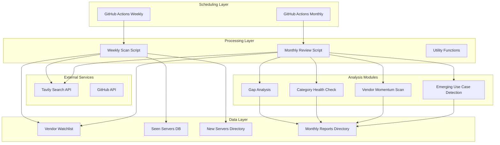

# Design Document: Automated MCP Intelligence System

## Overview

The Automated MCP Intelligence System is a comprehensive monitoring and analysis platform designed to automatically discover, track, and analyze Model Context Protocol (MCP) servers. The system integrates with the Tavily Search API to perform scheduled scans, maintain a vendor watchlist, and generate actionable insights through four specialized analysis modules. Built on an existing Astro repository, the system follows a human-in-the-loop approach where automation surfaces potential servers and humans make final inclusion decisions.

### Core Objectives
1. **Automated Discovery**: Detect new commercial and official vendor MCP servers within 7 days of release
2. **Niche Detection**: Surface valuable but underappreciated MCP servers that don't rank on GitHub stars
3. **Competitive Intelligence**: Generate monthly gap analysis comparing our directory against competitors
4. **Content Generation**: Feed editorial calendars with demand-driven content topics
5. **Data Quality**: Maintain organized, versioned data storage with proper schema and validation

### Key Design Principles
- **Human-in-the-loop**: Automation finds, humans decide
- **Graceful Degradation**: Continue processing when API calls fail
- **Incremental Processing**: Process data in manageable chunks
- **Schema Consistency**: Uniform data structures across all components
- **Audit Trail**: Track all decisions and changes

## Architecture

### System Architecture Overview



### Component Architecture

The system follows a layered architecture with clear separation of concerns:

1. **Scheduling Layer** (.github/workflows/)
   - GitHub Actions workflows for scheduled execution
   - Environment variable management
   - Error handling and notifications

2. **Processing Layer** (scripts/tavily/)
   - JavaScript modules for business logic
   - API integration and data processing
   - Utility functions for common operations

3. **Data Layer** (data/)
   - JSON-based storage with consistent schemas
   - Deduplication database (seen-servers.json)
   - Vendor watchlist configuration
   - Time-stamped output directories

4. **Analysis Layer** (scripts/tavily/analysis/)
   - Four specialized analysis modules
   - Statistical and trend analysis
   - Report generation

### Data Flow

#### Weekly Scan Flow
1. **Trigger**: GitHub Actions workflow runs every Monday at 8:00am UTC
2. **Search**: Query Tavily API for each vendor in watchlist
3. **Deduplication**: Check against seen-servers.json
4. **Storage**: Save new servers to /data/new-servers/YYYY-MM-DD.json
5. **Update**: Add new servers to seen-servers.json
6. **Notification**: Send completion status

#### Monthly Deep Dive Flow
1. **Trigger**: GitHub Actions workflow runs first Monday of each month
2. **Data Collection**: Gather data from multiple sources
3. **Analysis**: Run four analysis modules
4. **Report Generation**: Create comprehensive monthly report
5. **Storage**: Save report to /data/monthly-reports/YYYY-MM.json
6. **Notification**: Send analysis completion status

## Components and Interfaces

### GitHub Actions Workflows

#### Weekly Scan Workflow (.github/workflows/mcp-weekly-scan.yml)
```yaml
name: MCP Weekly Server Scan
on:
  schedule:
    - cron: '0 8 * * 1'  # Every Monday at 8:00am UTC
  workflow_dispatch:  # Manual trigger option

jobs:
  scan:
    runs-on: ubuntu-latest
    steps:
      - uses: actions/checkout@v4
      - uses: actions/setup-node@v4
        with:
          node-version: '20'
      - run: npm ci
      - name: Run Weekly Scan
        env:
          TAVILY_API_KEY: ${{ secrets.TAVILY_API_KEY }}
        run: node scripts/tavily/weekly-scan.js
      - name: Commit Results
        if: success()
        run: |
          git config --local user.email "action@github.com"
          git config --local user.name "GitHub Action"
          git add data/
          git commit -m "Weekly MCP scan results $(date +'%Y-%m-%d')" || echo "No changes to commit"
          git push
```

#### Monthly Review Workflow (.github/workflows/mcp-monthly-review.yml)
```yaml
name: MCP Monthly Deep Dive
on:
  schedule:
    - cron: '0 8 1-7 * 1'  # First Monday of each month at 8:00am UTC
  workflow_dispatch:  # Manual trigger option

jobs:
  review:
    runs-on: ubuntu-latest
    steps:
      - uses: actions/checkout@v4
      - uses: actions/setup-node@v4
        with:
          node-version: '20'
      - run: npm ci
      - name: Run Monthly Review
        env:
          TAVILY_API_KEY: ${{ secrets.TAVILY_API_KEY }}
        run: node scripts/tavily/monthly-review.js
      - name: Commit Results
        if: success()
        run: |
          git config --local user.email "action@github.com"
          git config --local user.name "GitHub Action"
          git add data/
          git commit -m "Monthly MCP review $(date +'%Y-%m')" || echo "No changes to commit"
          git push
```

### Script Modules

#### Weekly Scan Script (scripts/tavily/weekly-scan.js)
**Responsibilities**:
- Load vendor watchlist
- Query Tavily API for each vendor
- Perform deduplication against seen-servers.json
- Save new servers with consistent metadata
- Update seen-servers.json
- Generate summary statistics

**Interface**:
```javascript
// Main function signature
async function runWeeklyScan() {
  // Returns: { success: boolean, stats: object, errors: array }
}

// Key functions
function queryTavilyForVendor(vendor, apiKey) {}
function deduplicateServers(discoveredServers, seenServers) {}
function saveNewServers(newServers, date) {}
function updateSeenServers(newServers) {}
```

#### Monthly Review Script (scripts/tavily/monthly-review.js)
**Responsibilities**:
- Load historical data
- Execute four analysis modules
- Generate comprehensive report
- Save report with timestamp
- Provide executive summary

**Interface**:
```javascript
// Main function signature
async function runMonthlyReview() {
  // Returns: { success: boolean, report: object, insights: array }
}

// Analysis module coordination
function runAllAnalyses(data) {
  return {
    gapAnalysis: runGapAnalysis(data),
    categoryHealth: runCategoryHealthCheck(data),
    vendorMomentum: runVendorMomentumScan(data),
    emergingUseCases: runEmergingUseCaseDetection(data)
  };
}
```

#### Utility Module (scripts/tavily/utils.js)
**Responsibilities**:
- Common data validation functions
- JSON schema validation
- Error handling utilities
- Logging and notification helpers
- File system operations

**Key Functions**:
```javascript
function validateServerSchema(server) {}
function validateReportSchema(report) {}
function logWithTimestamp(message, level = 'info') {}
function sendNotification(type, content) {}
function ensureDirectoryExists(path) {}
```

#### Vendor Watchlist (scripts/tavily/vendor-watchlist.json)
**Structure**:
```json
{
  "version": "1.0.0",
  "lastUpdated": "2024-01-01",
  "vendors": [
    {
      "name": "OpenAI",
      "category": "AI/ML",
      "searchTerms": ["OpenAI MCP server", "OpenAI Model Context Protocol"],
      "priority": "high",
      "notes": "Official vendor, likely to release new servers"
    },
    // ... 50+ vendors organized by category
  ],
  "categories": [
    "AI/ML",
    "Database",
    "Cloud Services",
    "Development Tools",
    "Productivity",
    "Communication"
  ]
}
```

### Analysis Modules

#### 1. Gap Analysis Module
**Purpose**: Compare our MCP server directory against competitor directories
**Input**: Our directory data, competitor directory data
**Output**: Ranked list of coverage gaps with recommendations
**Key Metrics**:
- Missing server count by category
- High-priority gaps (popular vendors/categories)
- Strategic opportunity scores

#### 2. Category Health Check Module
**Purpose**: Analyze server distribution across categories
**Input**: All server data categorized
**Output**: Category health assessment with recommendations
**Key Metrics**:
- Server count per category
- Category growth rates
- Category balance scores
- Underrepresented categories

#### 3. Vendor Momentum Scan Module
**Purpose**: Track vendor activity and new server releases
**Input**: Vendor activity data over time
**Output**: Vendor momentum report with trends
**Key Metrics**:
- New servers per vendor (monthly)
- Vendor activity scores
- Emerging vendor identification
- Vendor churn rates

#### 4. Emerging Use Case Detection Module
**Purpose**: Identify new patterns in MCP server development
**Input**: Server descriptions, functionality, metadata
**Output**: Emerging use case report with content topics
**Key Metrics**:
- Use case frequency trends
- Cross-category pattern detection
- Content topic relevance scores
- Search demand estimates

## Data Models

### Core Data Structures

#### Server Object Schema
```typescript
interface Server {
  // Identification
  id: string;                    // UUID v4
  name: string;                  // Server name
  vendor: string;                // Vendor name
  vendorCategory: string;        // AI/ML, Database, etc.
  
  // Discovery Information
  discoveryDate: string;         // ISO 8601 date
  discoverySource: string;       // 'tavily', 'manual', 'competitor'
  searchQuery: string;           // Original search query
  confidenceScore: number;       // 0-1 confidence in discovery
  
  // Technical Details
  githubUrl?: string;            // GitHub repository URL
  documentationUrl?: string;     // Official documentation
  npmPackage?: string;           // NPM package name
  version?: string;              // Current version
  
  // Metadata
  description: string;           // Brief description
  tags: string[];                // Categorization tags
  useCases: string[];            // Primary use cases
  
  // Engagement Metrics
  githubStars?: number;          // GitHub star count
  lastCommitDate?: string;       // Last commit date
  issueCount?: number;           // Open issues
  pullRequestCount?: number;     // Open PRs
  
  // Review Status
  status: 'pending' | 'approved' | 'rejected';
  reviewDate?: string;           // When reviewed
  reviewer?: string;             // Who reviewed
  rejectionReason?: string;      // If rejected
  
  // Timestamps
  createdAt: string;             // When added to system
  updatedAt: string;             // Last update
}
```

#### Vendor Object Schema
```typescript
interface Vendor {
  name: string;                  // Vendor name
  category: string;              // Primary category
  searchTerms: string[];         // Search queries
  priority: 'low' | 'medium' | 'high';
  notes?: string;                // Additional context
  
  // Tracking
  firstSeen: string;             // First discovery date
  lastSeen: string;              // Last discovery date
  serverCount: number;           // Total servers discovered
  active: boolean;               // Currently active
  
  // Performance Metrics
  discoveryRate: number;         // Servers per month
  approvalRate: number;          // Approval percentage
  nicheScore?: number;           // Niche detection score
}
```

#### Monthly Report Schema
```typescript
interface MonthlyReport {
  // Report Metadata
  reportId: string;              // UUID v4
  reportDate: string;            // Month being reported (YYYY-MM)
  generatedAt: string;           // Generation timestamp
  period: {                      // Date range
    start: string;               // Start date (inclusive)
    end: string;                 // End date (exclusive)
  };
  
  // Executive Summary
  summary: {
    totalServersDiscovered: number;
    newVendors: number;
    approvalRate: number;
    keyInsights: string[];
    recommendations: string[];
  };
  
  // Analysis Results
  gapAnalysis: GapAnalysisResult;
  categoryHealth: CategoryHealthResult;
  vendorMomentum: VendorMomentumResult;
  emergingUseCases: EmergingUseCaseResult;
  
  // Raw Data References
  dataSources: {
    newServersFile: string;      // Path to new servers data
    seenServersFile: string;     // Path to seen servers
    vendorWatchlist: string;     // Path to watchlist
  };
  
  // Performance Metrics
  metrics: {
    scanDuration: number;        // Milliseconds
    apiCalls: number;            // Tavily API calls
    errorCount: number;          // Processing errors
    successRate: number;         // 0-1 success rate
  };
}
```

#### Gap Analysis Result Schema
```typescript
interface GapAnalysisResult {
  competitorCount: number;       // Number of competitors analyzed
  totalGaps: number;             // Total missing servers
  
  gapsByCategory: Array<{
    category: string;
    gapCount: number;
    priority: 'low' | 'medium' | 'high';
    exampleServers: string[];
  }>;
  
  gapsByVendor: Array<{
    vendor: string;
    gapCount: number;
    vendorPriority: string;
    missingServers: Array<{
      name: string;
      estimatedPopularity: number;
      reasonForImportance: string;
    }>;
  }>;
  
  recommendations: Array<{
    priority: number;            // 1-10 priority score
    action: string;              // Recommended action
    expectedImpact: string;      // Expected outcome
    effortEstimate: 'low' | 'medium' | 'high';
  }>;
}
```

#### Category Health Result Schema
```typescript
interface CategoryHealthResult {
  categories: Array<{
    name: string;
    serverCount: number;
    growthRate: number;          // Monthly growth percentage
    healthScore: number;         // 0-100 health score
    
    // Distribution Metrics
    percentageOfTotal: number;   // Percentage of all servers
    idealPercentage: number;     // Target percentage
    deviation: number;           // Deviation from ideal
    
    // Quality Metrics
    averageStars: number;        // Average GitHub stars
    approvalRate: number;        // Human approval rate
    nicheScore: number;          // Niche detection score
  }>;
  
  overallHealth: {
    score: number;               // Overall health score
    status: 'poor' | 'fair' | 'good' | 'excellent';
    strengths: string[];
    weaknesses: string[];
  };
  
  recommendations: Array<{
    category: string;
    action: 'expand' | 'maintain' | 'consolidate';
    rationale: string;
    priority: number;
  }>;
}
```

#### Vendor Momentum Result Schema
```typescript
interface VendorMomentumResult {
  vendors: Array<{
    name: string;
    category: string;
    
    // Activity Metrics
    totalServers: number;
    newThisMonth: number;
    growthRate: number;          // Monthly growth percentage
    
    // Momentum Scores
    activityScore: number;       // 0-100 based on recent activity
    momentumScore: number;       // 0-100 trend-based score
    trend: 'declining' | 'stable' | 'growing' | 'exploding';
    
    // Historical Context
    firstServerDate: string;
    lastServerDate: string;
    averageReleaseInterval: number;  // Days between releases
  }>;
  
  trends: {
    topGrowingVendors: string[];
    topDecliningVendors: string[];
    emergingVendors: string[];   // New vendors with potential
    churnedVendors: string[];    // Vendors that stopped releasing
  };
  
  insights: Array<{
    type: 'opportunity' | 'risk' | 'trend';
    description: string;
    impact: 'low' | 'medium' | 'high';
    evidence: string[];
  }>;
}
```

#### Emerging Use Case Result Schema
```typescript
interface EmergingUseCaseResult {
  useCases: Array<{
    name: string;
    description: string;
    
    // Detection Metrics
    frequency: number;           // Occurrences this month
    growthRate: number;          // Month-over-month growth
    confidence: number;          // 0-1 confidence score
    
    // Server Associations
    exampleServers: string[];
    primaryCategories: string[];
    commonVendors: string[];
    
    // Content Potential
    searchVolumeEstimate: number;
    competitionLevel: 'low' | 'medium' | 'high';
    contentAngles: string[];
  }>;
  
  contentTopics: Array<{
    title: string;
    useCase: string;
    
    // Content Metrics
    relevanceScore: number;      // 0-100 relevance to audience
    demandScore: number;         // 0-100 estimated demand
    uniquenessScore: number;     // 0-100 content gap
    
    // Practical Details
    targetKeywords: string[];
    estimatedWordCount: number;
    suggestedFormat: 'blog' | 'tutorial' | 'comparison' | 'case-study';
    
    // Integration
    editorialCalendarSlot?: string;
    priority: 'low' | 'medium' | 'high' | 'urgent';
  }>;
  
  trends: {
    topUseCases: string[];
    decliningUseCases: string[];
    crossCategoryPatterns: string[];
    innovationAreas: string[];   // Areas with high innovation
  };
}
```

### File System Structure

```
data/
├── new-servers/
│   ├── 2024-01-01.json
│   ├── 2024-01-08.json
│   └── ... (weekly files)
├── monthly-reports/
│   ├── 2024-01.json
│   ├── 2024-02.json
│   └── ... (monthly files)
└── seen-servers.json

scripts/tavily/
├── weekly-scan.js
├── monthly-review.js
├── vendor-watchlist.json
├── utils.js
└── analysis/
    ├── gap-analysis.js
    ├── category-health.js
    ├── vendor-momentum.js
    └── emerging-use-cases.js

.github/workflows/
├── mcp-weekly-scan.yml
└── mcp-monthly-review.yml
```

### Data Validation Rules

1. **Server Validation**:
   - Required fields: id, name, vendor, discoveryDate, status
   - GitHub URL must match pattern: `https://github.com/.*`
   - Dates must be valid ISO 8601 strings
   - Confidence scores must be between 0 and 1

2. **Report Validation**:
   - All analysis results must be present
   - Metrics must be non-negative numbers
   - Recommendations must have priority scores
   - Data source references must be valid paths

3. **Cross-Validation**:
   - Server IDs must be unique across all files
   - Vendor names must match watchlist entries
   - Dates must be chronologically consistent
   - Status transitions must follow valid paths

### Data Retention Policy

1. **New Servers**: Keep for 90 days, then archive
2. **Monthly Reports**: Keep indefinitely
3. **Seen Servers**: Keep all historical entries
4. **Vendor Watchlist**: Versioned with change history
5. **Error Logs**: Keep for 30 days

### Backup Strategy

1. **Git Versioning**: All data files committed to Git
2. **Cloud Backup**: Weekly backups to cloud storage
3. **Point-in-Time Recovery**: Daily snapshots for critical data
4. **Disaster Recovery**: Full system restore capability

---
*Note: The design document continues with Correctness Properties, Error Handling, and Testing Strategy sections after prework analysis.*
## Correctness Properties

*A property is a characteristic or behavior that should hold true across all valid executions of a system—essentially, a formal statement about what the system should do. Properties serve as the bridge between human-readable specifications and machine-verifiable correctness guarantees.*

### Property Reflection

Before defining specific properties, we performed a reflection to eliminate redundancy and combine related properties:

1. **Storage properties consolidated**: Instead of separate properties for each storage location and format, we combine them into comprehensive storage validation properties.

2. **Data completeness unified**: Rather than testing each output type separately, we define universal data completeness properties.

3. **Module functionality grouped**: Analysis module properties are combined into a single comprehensive property about module outputs.

4. **Error handling comprehensive**: Multiple error handling requirements are combined into resilience properties.

5. **File organization unified**: Directory location properties are combined into a single file system structure property.

### Property 1: Weekly Scan Execution

*For any* valid vendor watchlist and Tavily API configuration, when the weekly scan job is triggered, the system shall query the Tavily API for each vendor in the watchlist.

**Validates: Requirements 1.1, 1.2**

### Property 2: Server Deduplication

*For any* set of discovered servers and existing seen-servers database, the deduplication process shall filter out servers that already exist in the database while preserving all unique new servers.

**Validates: Requirements 1.3**

### Property 3: Data Storage Consistency

*For any* valid server data that passes deduplication, the system shall:
1. Store it in the `/data/new-servers/` directory with YYYY-MM-DD filename format
2. Format it as valid JSON with consistent schema
3. Include all required metadata fields (name, vendor, GitHub URL, discovery date)
4. Mark it with "pending review" status
5. Update the seen-servers.json database

**Validates: Requirements 1.4, 1.5, 1.6, 5.2, 7.1, 7.3, 7.4**

### Property 4: Niche Server Detection

*For any* discovered server with low GitHub star count but high engagement signals (documentation quality, recent activity, unique functionality), the niche detection algorithm shall:
1. Identify it as a niche candidate
2. Assign a confidence score between 0 and 1 based on multiple signals
3. Flag it for human review with specific rationale
4. Include both rationale and confidence score in stored data

**Validates: Requirements 2.1, 2.2, 2.3, 2.4, 2.5**

### Property 5: Gap Analysis Completeness

*For any* comparison between our directory and competitor directories, the gap analysis shall:
1. Identify all servers present in competitor directories but missing from ours
2. Categorize gaps by vendor, category, and use case
3. Produce a ranked list of high-priority gaps
4. Include actionable recommendations for each identified gap
5. Save the analysis to `/data/monthly-reports/` with timestamp

**Validates: Requirements 3.1, 3.2, 3.3, 3.4, 3.5, 3.6**

### Property 6: Content Topic Generation

*For any* analysis of discovered servers, the content topic generation shall:
1. Identify emerging patterns and use cases
2. Generate topic suggestions based on search volume and relevance
3. Prioritize topics with high search demand and low existing coverage
4. Include target keywords, estimated search volume, and content angle for all topics
5. Format suggestions for easy integration into editorial calendars

**Validates: Requirements 4.1, 4.2, 4.3, 4.4, 4.5**

### Property 7: Human Review Workflow

*For any* discovered server:
1. It shall NOT be automatically added to the public directory
2. When presented for review, it shall include comprehensive metadata and discovery context
3. If approved, its status shall change to "approved" and it shall be added to the public directory
4. If rejected, its status shall change to "rejected" with optional rejection reason
5. All review decisions shall create an audit trail with reviewer, timestamp, and decision

**Validates: Requirements 5.1, 5.3, 5.4, 5.5, 5.6**

### Property 8: System Observability

*For any* scheduled job execution:
1. It shall log start time, completion status, and any errors encountered
2. It shall send notification of completion status to configured channels
3. When errors occur, it shall implement graceful degradation and continue processing where possible
4. For data operations, it shall implement proper error handling and data validation
5. When data validation fails, it shall log the error and skip the problematic entry without failing the entire job

**Validates: Requirements 6.3, 6.4, 6.5, 7.5, 7.6**

### Property 9: Analysis Module Outputs

*For any* monthly report generation, all analysis modules shall:
1. Gap Analysis Module: Compare our directory against competitors
2. Category Health Check Module: Analyze server distribution across categories
3. Vendor Momentum Scan Module: Track vendor activity and new releases
4. Emerging Use Case Detection Module: Identify new patterns in MCP development
5. Produce both quantitative metrics and qualitative insights
6. Include visualizations and executive summaries in stored results

**Validates: Requirements 8.1, 8.2, 8.3, 8.4, 8.5, 8.6**

### Property 10: File System Structure

*For all* system components:
1. Workflow files shall be placed in `.github/workflows/` directory
2. Script files shall be placed in `scripts/tavily/` directory
3. Data directories shall be placed in `/data/` directory
4. Monthly reports shall be stored in `/data/monthly-reports/` with YYYY-MM filename format

**Validates: Requirements 7.2, 9.2, 9.3, 9.4**

### Property 11: Round-Trip Data Integrity

*For any* valid server object:
1. Serializing then deserializing the object shall produce an equivalent object
2. All metadata fields shall be preserved through the storage and retrieval cycle
3. Status transitions shall maintain audit trail consistency
4. Confidence scores and rationale shall remain unchanged through processing

**Validates: Implicit requirement for data consistency across all requirements**

### Property 12: Idempotent Processing

*For any* set of servers processed multiple times:
1. Running the weekly scan twice with the same input shall produce the same output
2. Deduplication shall be idempotent (applying it twice equals applying it once)
3. Status updates shall be idempotent (approving an already approved server has no effect)
4. Analysis results shall be deterministic given the same input data

**Validates: Implicit requirement for predictable system behavior**

## Error Handling

### Error Classification

The system classifies errors into three categories:

1. **Recoverable Errors**: API timeouts, temporary network issues, rate limiting
   - Strategy: Retry with exponential backoff, continue processing other items
   - Example: Tavily API returns 429 Too Many Requests

2. **Data Validation Errors**: Invalid JSON, missing required fields, schema violations
   - Strategy: Log error, skip problematic entry, continue processing
   - Example: Server data missing required "name" field

3. **System Errors**: File system failures, memory exhaustion, configuration errors
   - Strategy: Log critical error, attempt graceful shutdown, notify administrators
   - Example: Cannot write to `/data/new-servers/` directory

### Error Handling Strategies

#### Graceful Degradation
```javascript
async function processWithGracefulDegradation(items, processor) {
  const results = [];
  const errors = [];
  
  for (const item of items) {
    try {
      const result = await processor(item);
      results.push(result);
    } catch (error) {
      errors.push({
        item,
        error: error.message,
        timestamp: new Date().toISOString()
      });
      
      // Continue processing next item
      logError(`Skipping item due to error: ${error.message}`);
    }
  }
  
  return { results, errors };
}
```

#### Retry with Exponential Backoff
```javascript
async function retryWithBackoff(operation, maxRetries = 3) {
  let lastError;
  
  for (let attempt = 1; attempt <= maxRetries; attempt++) {
    try {
      return await operation();
    } catch (error) {
      lastError = error;
      
      if (attempt === maxRetries) break;
      
      // Exponential backoff: 1s, 2s, 4s, etc.
      const delay = Math.pow(2, attempt - 1) * 1000;
      await new Promise(resolve => setTimeout(resolve, delay));
    }
  }
  
  throw lastError;
}
```

#### Data Validation and Sanitization
```javascript
function validateServerSchema(server) {
  const requiredFields = ['id', 'name', 'vendor', 'discoveryDate', 'status'];
  const missingFields = requiredFields.filter(field => !server[field]);
  
  if (missingFields.length > 0) {
    throw new ValidationError(`Missing required fields: ${missingFields.join(', ')}`);
  }
  
  // Validate field types and formats
  if (typeof server.confidenceScore !== 'number' || 
      server.confidenceScore < 0 || server.confidenceScore > 1) {
    throw new ValidationError('confidenceScore must be a number between 0 and 1');
  }
  
  // Validate date format
  if (!isValidISODate(server.discoveryDate)) {
    throw new ValidationError('discoveryDate must be valid ISO 8601 date');
  }
  
  return true;
}
```

### Error Recovery Procedures

#### Weekly Scan Recovery
1. **API Failure**: Log error, skip affected vendor, continue with next vendor
2. **File System Error**: Attempt to write to backup location, notify admin
3. **Memory Exhaustion**: Process vendors in smaller batches, log memory usage
4. **Network Issues**: Retry with backoff, fall back to cached data if available

#### Monthly Review Recovery
1. **Data Corruption**: Use last known good data, flag for manual review
2. **Analysis Module Failure**: Skip failed module, generate partial report
3. **Report Generation Error**: Save intermediate results, attempt regeneration
4. **Notification Failure**: Queue notifications for retry, log delivery status

#### Data Integrity Recovery
1. **Schema Violation**: Attempt to fix common issues, log unfixable errors
2. **Duplicate Detection**: Use checksum-based deduplication as fallback
3. **Audit Trail Corruption**: Reconstruct from transaction logs if possible
4. **Backup Restoration**: Restore from most recent valid backup

### Monitoring and Alerting

#### Error Metrics
- **Error Rate**: Percentage of operations that fail
- **Recovery Rate**: Percentage of errors successfully recovered from
- **Mean Time to Recovery (MTTR)**: Average time to recover from errors
- **Error Severity Distribution**: Breakdown of error types by severity

#### Alert Thresholds
- **Warning**: Error rate > 5% for any component
- **Critical**: Error rate > 20% or system errors detected
- **Emergency**: Data corruption or complete system failure

#### Notification Channels
1. **Slack**: Real-time alerts for critical errors
2. **Email**: Daily error summary reports
3. **PagerDuty**: Escalation for unhandled system errors
4. **Dashboard**: Real-time error monitoring dashboard

## Testing Strategy

### Dual Testing Approach

The system employs a comprehensive testing strategy combining unit tests and property-based tests:

1. **Unit Tests**: Verify specific examples, edge cases, and error conditions
2. **Property Tests**: Verify universal properties across all valid inputs
3. **Integration Tests**: Verify component interactions and data flow
4. **End-to-End Tests**: Verify complete system functionality

### Property-Based Testing Configuration

#### Testing Library Selection
- **Primary**: Fast-check for property-based testing
- **Secondary**: Jest for unit and integration testing
- **Utilities**: Supertest for API testing, node-mocks-http for HTTP mocking

#### Property Test Configuration
```javascript
// Example property test configuration
const fc = require('fast-check');

describe('Server Deduplication Property', () => {
  it('should filter duplicates while preserving unique servers', () => {
    fc.assert(
      fc.property(
        fc.array(fc.record({
          id: fc.uuid(),
          name: fc.string(),
          vendor: fc.string()
        })),
        fc.array(fc.uuid()),
        (servers, existingIds) => {
          // Test implementation
          const result = deduplicateServers(servers, existingIds);
          
          // Property: No duplicates in result
          const resultIds = result.map(s => s.id);
          const uniqueIds = new Set(resultIds);
          return resultIds.length === uniqueIds.size;
        }
      ),
      { numRuns: 100 }  // Minimum 100 iterations per property
    );
  });
});
```

### Test Organization

#### Directory Structure
```
tests/
├── unit/
│   ├── tavily/
│   │   ├── weekly-scan.test.js
│   │   ├── monthly-review.test.js
│   │   └── utils.test.js
│   └── analysis/
│       ├── gap-analysis.test.js
│       ├── category-health.test.js
│       ├── vendor-momentum.test.js
│       └── emerging-use-cases.test.js
├── property/
│   ├── storage-properties.test.js
│   ├── deduplication-properties.test.js
│   ├── analysis-properties.test.js
│   └── workflow-properties.test.js
├── integration/
│   ├── github-workflows.test.js
│   ├── api-integration.test.js
│   └── data-flow.test.js
└── e2e/
    ├── weekly-scan-e2e.test.js
    └── monthly-review-e2e.test.js
```

#### Test Tagging Convention
```javascript
// Property test tagging
describe('Property 3: Data Storage Consistency', () => {
  // Feature: mcp-intelligence-system, Property 3: Data Storage Consistency
  it('should store servers with correct format and metadata', () => {
    // Test implementation
  });
});

// Unit test tagging  
describe('Weekly Scan - Edge Cases', () => {
  // Feature: mcp-intelligence-system, Requirement 1.4
  it('should handle empty vendor watchlist', () => {
    // Test implementation
  });
});
```

### Test Data Generation

#### Property Test Generators
```javascript
// Server data generator for property tests
const serverGenerator = fc.record({
  id: fc.uuid(),
  name: fc.string({ minLength: 1, maxLength: 100 }),
  vendor: fc.oneof(
    fc.constant('OpenAI'),
    fc.constant('Anthropic'),
    fc.constant('Google'),
    fc.string({ minLength: 2, maxLength: 50 })
  ),
  discoveryDate: fc.date().map(d => d.toISOString()),
  status: fc.oneof(
    fc.constant('pending'),
    fc.constant('approved'),
    fc.constant('rejected')
  ),
  confidenceScore: fc.float({ min: 0, max: 1 }),
  githubUrl: fc.option(fc.webUrl(), { nil: undefined }),
  tags: fc.array(fc.string(), { minLength: 0, maxLength: 10 })
});

// Vendor watchlist generator
const vendorGenerator = fc.array(
  fc.record({
    name: fc.string({ minLength: 2, maxLength: 50 }),
    category: fc.oneof(
      fc.constant('AI/ML'),
      fc.constant('Database'),
      fc.constant('Cloud Services')
    ),
    searchTerms: fc.array(fc.string(), { minLength: 1, maxLength: 5 }),
    priority: fc.oneof(
      fc.constant('low'),
      fc.constant('medium'),
      fc.constant('high')
    )
  }),
  { minLength: 1, maxLength: 100 }
);
```

#### Edge Case Generators
```javascript
// Edge case generators for comprehensive testing
const edgeCaseGenerators = {
  emptyData: fc.constant([]),
  largeData: fc.array(serverGenerator, { minLength: 1000, maxLength: 10000 }),
  malformedData: fc.array(
    fc.record({
      // Intentionally malformed data
      id: fc.constant(123),  // Wrong type
      name: fc.constant(null),  // Null value
      vendor: fc.constant('')  // Empty string
    })
  ),
  duplicateData: fc.array(serverGenerator, { minLength: 10, maxLength: 100 })
    .chain(servers => fc.tuple(
      fc.constant(servers),
      fc.shuffledSubarray(servers)  // Create duplicates
    ))
};
```

### Test Coverage Goals

#### Unit Test Coverage
- **Statement Coverage**: ≥ 90%
- **Branch Coverage**: ≥ 85%
- **Function Coverage**: ≥ 95%
- **Line Coverage**: ≥ 90%

#### Property Test Coverage
- **Input Space Coverage**: Test across entire valid input space
- **Edge Case Coverage**: All identified edge cases tested
- **Property Verification**: All 12 correctness properties implemented as tests
- **Requirements Coverage**: All testable requirements covered by properties

#### Integration Test Coverage
- **Component Integration**: All component interactions tested
- **API Integration**: All external API integrations tested
- **Data Flow**: Complete data flow through system verified
- **Error Paths**: All error recovery paths tested

### Continuous Testing

#### GitHub Actions Test Workflow
```yaml
name: Test MCP Intelligence System
on:
  push:
    paths:
      - 'scripts/tavily/**'
      - 'tests/**'
      - '.github/workflows/mcp-*.yml'
  pull_request:
    paths:
      - 'scripts/tavily/**'
      - 'tests/**'

jobs:
  test:
    runs-on: ubuntu-latest
    steps:
      - uses: actions/checkout@v4
      - uses: actions/setup-node@v4
        with:
          node-version: '20'
      - run: npm ci
      - name: Run Unit Tests
        run: npm test -- --testPathPattern="unit"
      - name: Run Property Tests
        run: npm test -- --testPathPattern="property"
      - name: Run Integration Tests
        run: npm test -- --testPathPattern="integration"
      - name: Generate Coverage Report
        run: npm test -- --coverage
      - name: Upload Coverage
        uses: codecov/codecov-action@v3
```

#### Test Execution Strategy
1. **Pre-commit**: Run fast unit tests
2. **Pull Request**: Run all tests except end-to-end
3. **Main Branch**: Run complete test suite including end-to-end
4. **Scheduled**: Weekly comprehensive test runs

### Performance Testing

#### Load Testing
- **Concurrent Scans**: Test multiple simultaneous scan jobs
- **Large Data Sets**: Test with 10,000+ servers in database
- **API Rate Limiting**: Verify graceful handling of rate limits
- **Memory Usage**: Monitor memory consumption during processing

#### Scalability Testing
- **Vendor Scaling**: Test with 500+ vendors in watchlist
- **Data Growth**: Test with 6+ months of historical data
- **Concurrent Analysis**: Test multiple analysis modules running simultaneously
- **Storage Scaling**: Test with large report files (10MB+)

### Security Testing

#### Input Validation
- **SQL Injection**: Test for injection vulnerabilities in data processing
- **Path Traversal**: Test for directory traversal in file operations
- **Code Injection**: Test for code execution vulnerabilities
- **Data Exposure**: Test for sensitive data leakage

#### API Security
- **Authentication**: Test API key validation
- **Authorization**: Test access control for data operations
- **Rate Limiting**: Test enforcement of rate limits
- **Data Validation**: Test input sanitization

### Maintenance Testing

#### Regression Testing
- **Backward Compatibility**: Test that new changes don't break existing functionality
- **Data Migration**: Test migration scripts for schema changes
- **Configuration Changes**: Test impact of configuration updates
- **Dependency Updates**: Test with updated dependencies

#### Monitoring Tests
- **Error Detection**: Test that errors are properly detected and logged
- **Alert Generation**: Test that alerts are generated for critical errors
- **Recovery Verification**: Test that recovery procedures work correctly
- **Performance Monitoring**: Test that performance metrics are collected

### Test Data Management

#### Test Data Isolation
- **Separate Environments**: Use isolated test environments
- **Test Databases**: Use dedicated test database instances
- **Mock External Services**: Mock Tavily API and other external services
- **Cleanup Procedures**: Automatic cleanup of test data

#### Test Data Generation
- **Deterministic Generation**: Use seeded random generation for reproducibility
- **Realistic Data**: Generate data that mimics real-world patterns
- **Edge Case Coverage**: Include edge cases in generated data
- **Performance Data**: Generate data for performance testing

### Test Reporting

#### Test Results
- **Detailed Reports**: Comprehensive test execution reports
- **Failure Analysis**: Detailed analysis of test failures
- **Performance Metrics**: Performance test results
- **Coverage Reports**: Code coverage analysis

#### Quality Metrics
- **Test Pass Rate**: Percentage of tests passing
- **Defect Density**: Number of defects per lines of code
- **Mean Time to Detect**: Average time to detect defects
- **Test Effectiveness**: Effectiveness of tests in finding defects

### Continuous Improvement

#### Test Review Process
- **Regular Reviews**: Regular review of test coverage and effectiveness
- **Gap Analysis**: Analysis of untested code paths
- **Test Refactoring**: Refactoring tests for better maintainability
- **Performance Optimization**: Optimizing test execution time

#### Feedback Loop
- **Defect Analysis**: Analysis of defects found in production
- **Test Gap Identification**: Identifying gaps in test coverage
- **Process Improvement**: Improving testing processes based on feedback
- **Tool Evaluation**: Evaluating and adopting new testing tools

This comprehensive testing strategy ensures that the Automated MCP Intelligence System meets all requirements, handles errors gracefully, and maintains high quality throughout its lifecycle.